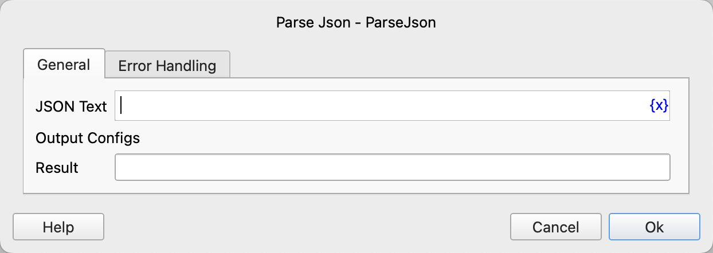

# Parse Json

Parse JSON text into corresponding type process objects and save them to variables.

## Instruction Configuration

### JSON Text

Input the JSON text to be parsed.

### Result

Input the variable name to save the parsed result.

Correspondence between JSON types and process object types:

| JSON Type | Process Object Type | JSON Example                 |
|-----------|---------------------|------------------------------|
| Object    | Dictionary          | {"name":"Tom","age":1}       |
| Array     | List                | [1,2,3]                      |
| String    | Text                | "hello"                      |
| Number    | Numeric             | 1.23                         |
| Boolean   | Boolean             | true, false                  |
| null      | Null                | null                         |

### Error Handling

If the instruction execution encounters an error, error handling will be executed. For details, refer to [Error Handling for Instructions](../../../manual/error_handling.md).
