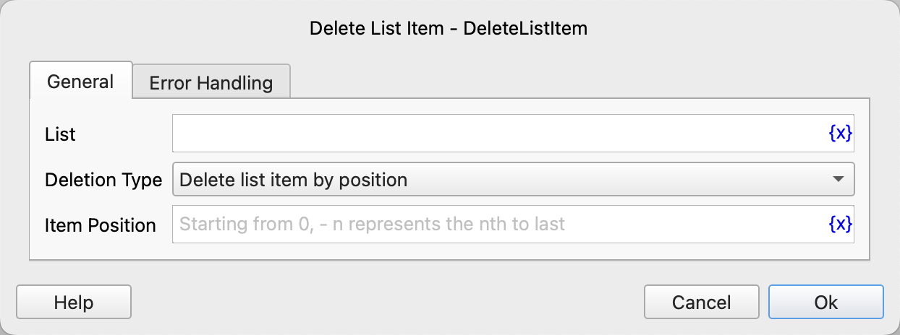

# Delete List Items

Delete a list item.

## Instruction Configuration

### List

Select the list object.

### Deletion Type

Select the deletion type. The available values are: delete list item by position, delete list item by value.

### Item Position

If you select to delete the list item by position, you need to enter the item position. It starts from 0, and -n represents the nth position from the end.

### Item Value

If you select to delete the list item by value, you need to enter the item value.

### Error Handling

If an error occurs during the execution of the instruction, error handling will be performed. For details, see [Error Handling of Instructions](../../../manual/error_handling.md).