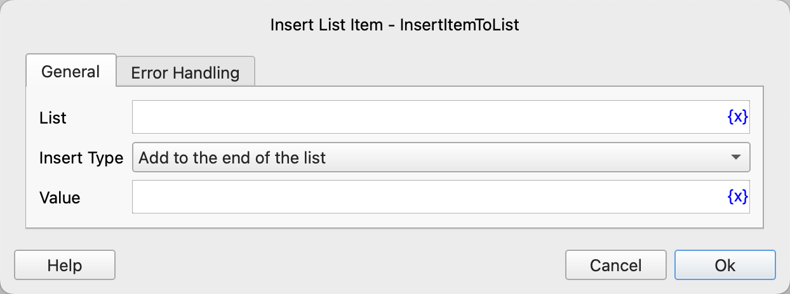

# Insert List Item

Insert a list item.

## Instruction Configuration

### List

Select the list object.

### Insert Type

Select the insert type. The available values are: Add to the End of the List, Insert at a Specified Position.

### Insert Position

If "Insert at a Specified Position" is selected, you need to enter the insert position. It starts from 0, and -n represents the nth position from the end.

### Value

Enter the value to be inserted.

### Error Handling

If an error occurs during the execution of the instruction, error handling will be performed. For details, see [Error Handling of Instructions](../../../manual/error_handling.md).