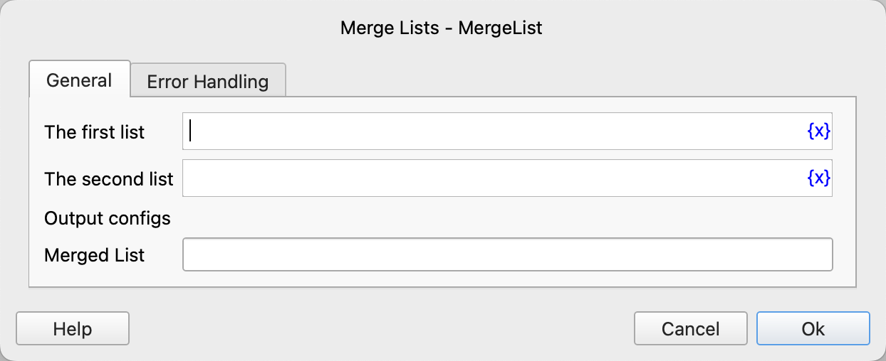

# Merge Lists

Merge two lists into a new list.

## Instruction Configuration

### The First List

Select the first list.

### The Second List

Select the second list.

### Merged List

Enter the variable name used to save the merged list.

### Error Handling

If an error occurs during the execution of the instruction, perform error handling. For details, see [Error Handling of Instructions](../../../manual/error_handling.md).
