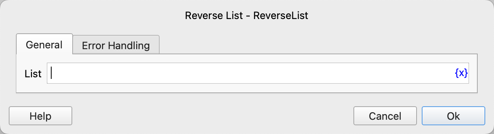

# Reverse List

Reverse the order of elements in the list.

## Instruction Configuration

### List

Select the list to be reversed.

### Error Handling

If an error occurs during the execution of the instruction, error handling will be carried out. For details, see [Error Handling of Instructions](../../../manual/error_handling.md).