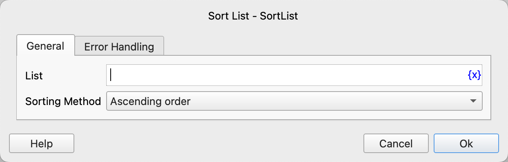

# Sort List

Sort the elements in the list.

## Instruction Configuration

### List

Select the list to be sorted.

### Sorting Method

Select the sorting method, ascending or descending.

### Error Handling

If an error occurs during the execution of the instruction, perform error handling. For details, see [Error Handling of Instructions](../../../manual/error_handling.md).
