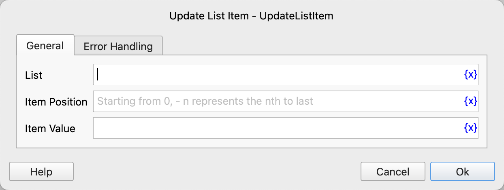

# Update List Item

Update the list item.

## Instruction Configuration

### List
Select the list object.

### Item Position
Enter the item position, starting from 0. -n represents the nth position from the end.

### Item Value
Enter the new item value.

### Error Handling
If an error occurs during the execution of the instruction, perform error handling. For details, see [Error Handling of Instructions](../../../manual/error_handling.md).