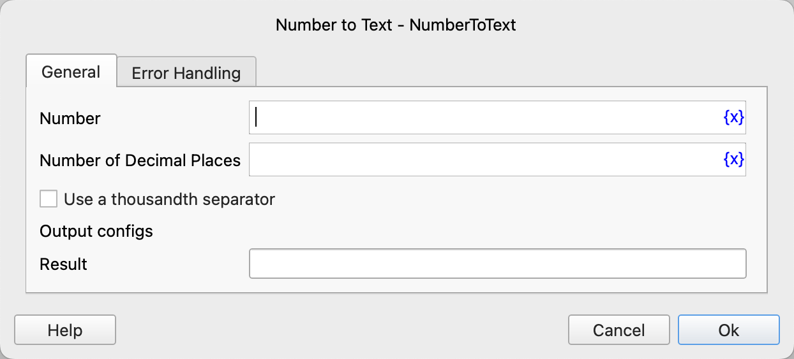

# Number to Text

Convert numbers to text.

## Instruction Configuration

### Number

Enter the number.

### Number of Decimal Places

Enter the number of decimal places to retain; digits beyond this will be rounded.

### Use a Thousandth Separator

Choose whether to use a thousandth separator (English comma).

### Result

Enter the variable name to store the conversion result.

### Error Handling

If the instruction execution fails, error handling will be performed. For details, see [Error Handling for Instructions](../../../manual/error_handling.md).
