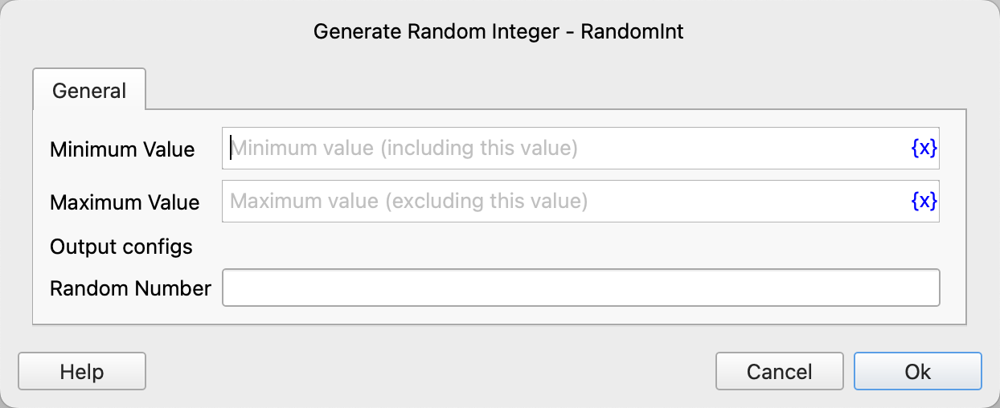

# Generate Random Integer

Generate random integers within a specified range.

## Instruction Configuration

### Minimum Value

Enter the minimum value, inclusive.

### Maximum Value

Enter the maximum value, exclusive.

### Random Number

Enter the variable name to store the random number.