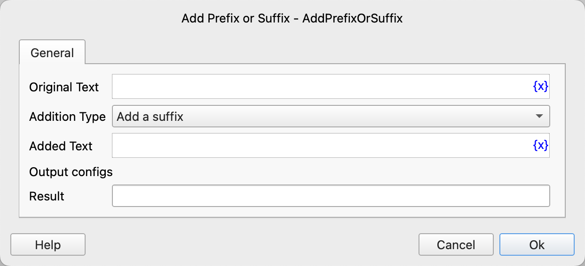

# Add Prefix or Suffix

Given the text, add a prefix or suffix and save the result to a variable.

## Instruction Configuration

### Original Text

Enter the original text.

### Addition Type

Choose to add a prefix or a suffix.

### Added Text

Enter the prefix or suffix to be added.

### Result

Enter the variable name used to save the new text.