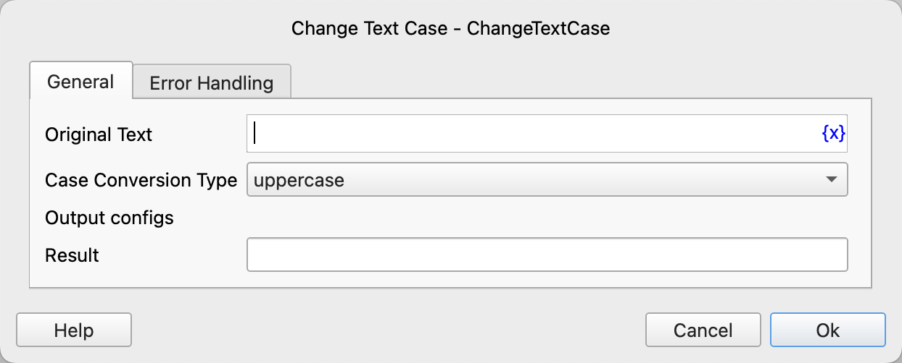

# Change Text Case

Change the case of the text.

## Instruction Configuration

### Original Text

Enter the original text.

### Case Conversion Type

Select the conversion type. The available values are: uppercase, lowercase, capitalize.

### Result

Enter the variable name used to save the conversion result.

### Error Handling

If an error occurs during the execution of the instruction, perform error handling. For details, see [Error Handling of Instructions](../../../manual/error_handling.md).