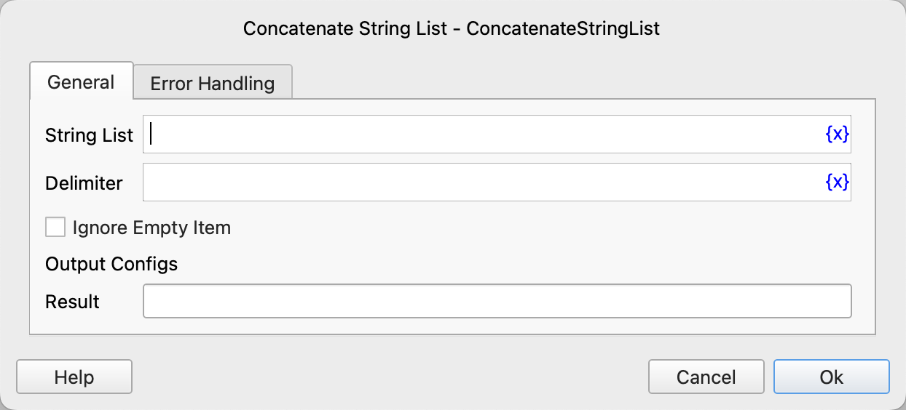

# Concatenate String List

Concatenates elements of a string list into a single string, with a specified separator.

## Instruction Configuration

### Input Parameters

- **String List**: The list of strings to concatenate.
- **Delimiter**: The delimiter to insert between concatenated strings. Leave empty if no delimiter is needed.
- **Ignore Empty Item**: Whether to filter out empty items.

### Output Parameters

- **Result**: The concatenated string.

### Error Handling

If the instruction encounters an error, error handling will be executed. For details, refer to [Error Handling of Instructions](../../../manual/error_handling.md).

### Examples

### Example 1: Concatenating String List with Empty Delimiter

Input:

- String List: ["Hello", "World", "Test"]
- Delimiter: "" (empty string)

Output:

- Result: "HelloWorldTest"

### Example 2: Concatenating String List with Space Delimiter

Input:

- String List: ["Hello", "World", "Test"]
- Delimiter: " " (space)

Output:

- Result: "Hello World Test"

### Example 3: Concatenating String List with Comma and Space Delimiter

Input:

- String List: ["Hello", "World", "Test"]
- Delimiter: ", " (comma and space)

Output:

- Result: "Hello, World, Test"

## Notes

- If the string list is empty, the result will be an empty string.
- If the string list contains non-string elements (e.g., numbers), they will be automatically converted to strings before concatenation.
- The delimiter can be any string, including an empty string.
