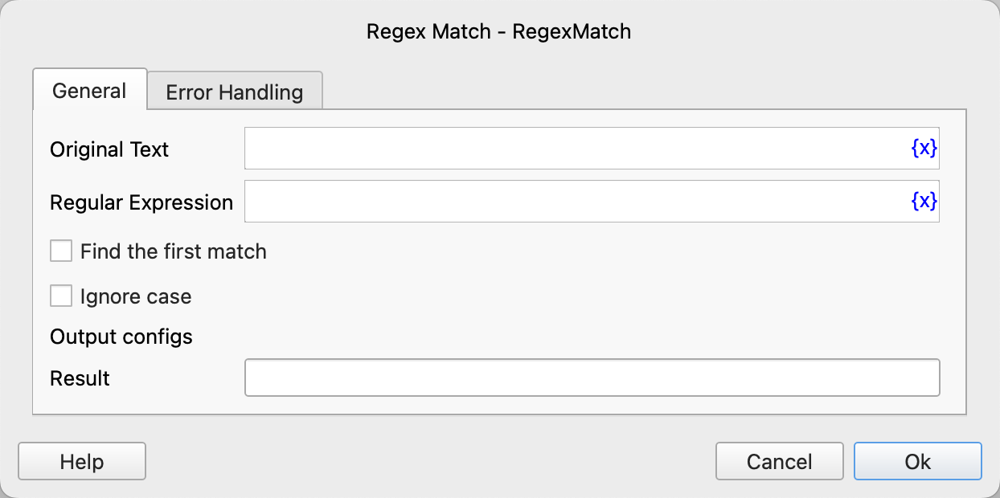

# Regex Match

Use regular expressions to find matching text and save the search results to a specified variable.

## Instruction Configuration

### Original Text

Enter the original text.

### Regular Expression

Enter the regular expression.

### Find the First Match

Select whether to find only the first match.

### Ignore Case

Select whether to ignore case.

### Result

Enter the variable name used to save the search results.

If "Find the First Match" is selected, the value of the result variable is the match. Otherwise, the value of the result variable is a list of matches.

### Error Handling

If an error occurs during the execution of the instruction, perform error handling. For details, see [Error Handling of Instructions](../../../manual/error_handling.md).
