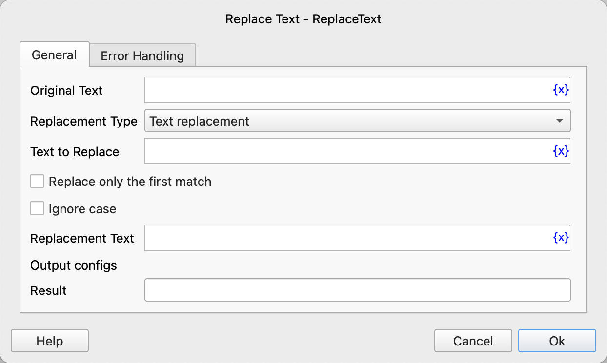

# Replace Text

Replace the specified text in the text with another text.

## Instruction Configuration

### Original Text

Enter the original text.

### Replacement Type

Select the replacement type. The available values are: Text Replacement, Regular Expression Replacement.

### Text to Replace

If you select Text Replacement, enter the text to replace.

### Regular Expression to Replace

If you select Regular Expression Replacement, enter the regular expression to replace.

### Replace Only the First Match

Select whether to replace only the first match.

### Ignore Case

Select whether to ignore case.

### Replacement Text

Enter the text to replace with.

### Result

Enter the variable name used to save the replaced text.

### Error Handling

If an error occurs during the execution of the instruction, perform error handling. For details, see [Error Handling of Instructions](../../../manual/error_handling.md).