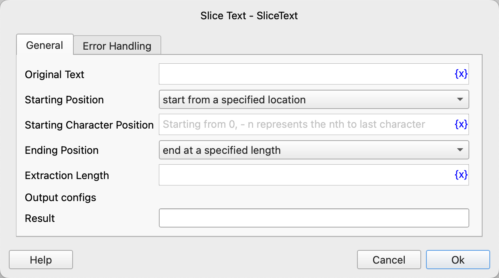

# Slice Text

Extract text within a specified range from the text and save it to a variable.

## Instruction Configuration

### Original Text

Enter the original text.

### Starting Position

Select the starting position. The available options are: start from the first character, start from a specified position, start from specified text.

### Starting Character Position

If the starting position is selected as starting from a specified position, enter the starting position. It starts from 0, and -n represents the nth character from the end.

### Starting Text Content

If the starting position is selected as starting from specified text, enter the starting text content.

### Ending Position

Select the ending position. The available options are: end at the end of the text, end at a specified length.

### Extraction Length

If the ending position is selected as ending at a specified length, enter the extraction length.

### Result

Enter the variable name used to save the extraction result.

### Error Handling

If an error occurs during the execution of the instruction, perform error handling. For details, see [Error Handling of Instructions](../../../manual/error_handling.md).
