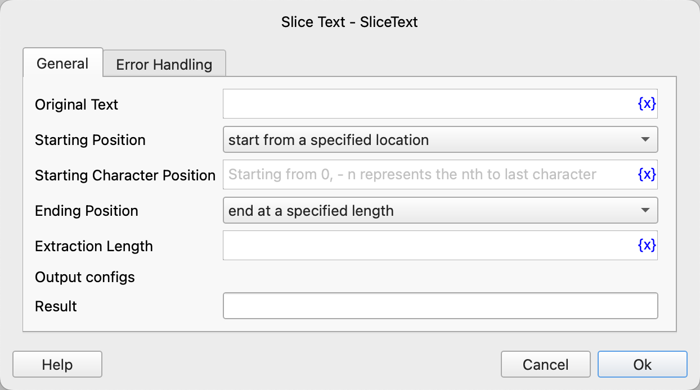

# Split Text

Split the text into a text list according to the specified delimiter.

## Instruction Configuration

### Text to Split

Enter the text to be split.

### Delimiter Type

Select the delimiter type. The available values are: Standard Delimiter, Custom Delimiter.

### Standard Delimiter

Select the standard delimiter to use. The available values are: space character, line break character, tab character.

### Custom Delimiter

If you select the custom delimiter, then enter the custom delimiter.

### Filter Empty Items

Choose whether to filter out the empty strings split out.

### Use Regular Expression

If you select the custom delimiter, then choose whether to use the custom delimiter as a regular expression.

### Result

Enter the variable name used to save the split text list.

### Error Handling

If an error occurs during the execution of the instruction, then perform error handling. For details, see [Error Handling of Instructions](../../../manual/error_handling.md).
