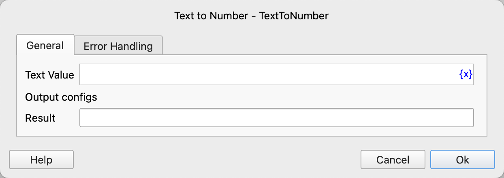

# Text to Number

Convert text to a numeric value.

## Instruction Configuration

### Text Value

Enter the text that needs to be converted. Integers, decimals, and the thousands separator "," are supported.

### Result

Enter the variable name used to save the conversion result.

### Error Handling

If the conversion fails, error handling will be executed. For details, see [Error Handling of Instructions](../../../manual/error_handling.md).
