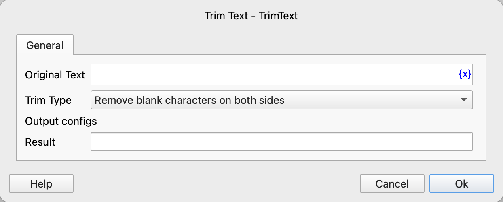

# Trim Text

Remove spaces in the text.

## Instruction Configuration

### Original Text

Enter the original text.

### Trim Type

Select the processing type. The available options are: remove blank characters on both sides, remove blank characters on the left, remove blank characters on the right.

### Result

Enter the variable name used to save the new text.
