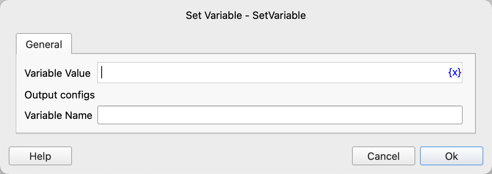

# Set Variable

Create a process-local variable and initialize it with the specified value.

## Instruction Configuration

### Variable Value

Enter the initial value of the variable.

### Variable Name

Enter the variable name.