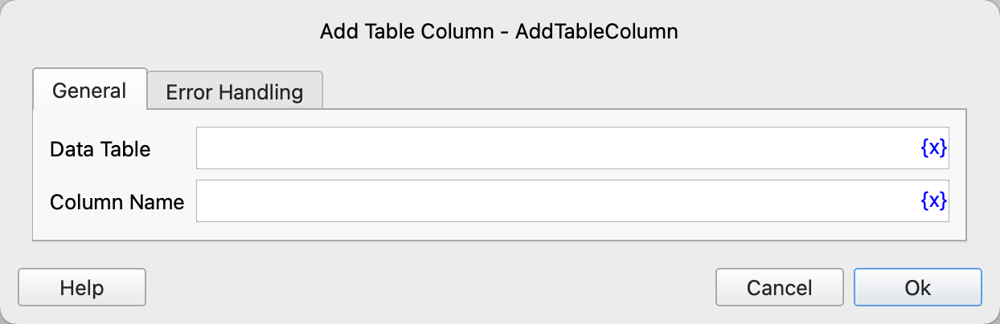

# Add Table Column

Add a new column to the data table.

## Instruction Configuration

### Data Table

Select the data table to operate on.

### Column Name

Enter the new column name.

### Error Handling

If an error occurs during the execution of the instruction, error handling will be performed. For details, see [Error Handling of Instructions](../../manual/error_handling.md).