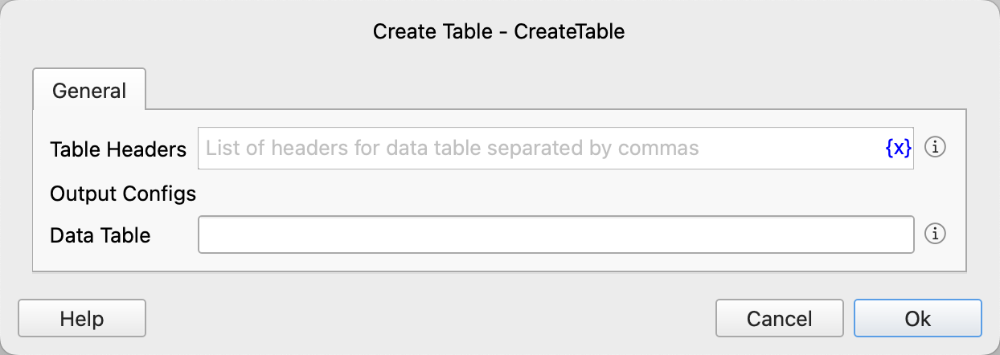

# Create Table

Create a data table variable.

## Instruction Configuration

### Table Headers

Enter a comma-separated list of data table headers.

### Data Table

Enter the variable name used to save the data table.

### Error Handling

If an error occurs during the execution of the instruction, error handling will be performed. For details, see [Error Handling of Instructions](../../manual/error_handling.md). 
