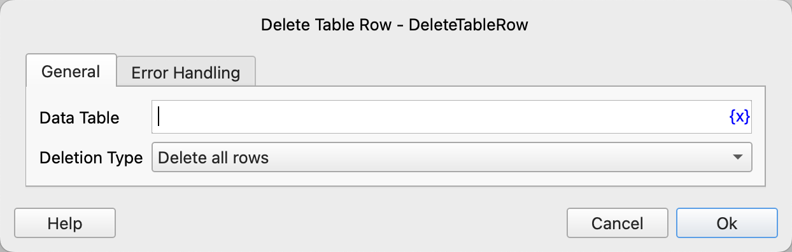

# Delete Table Row

Delete a row of data from a data table.

## Instruction Configuration

### Data Table

Select the data table to operate on.

### Deletion Type

Select the deletion type. Options include: Delete All Rows, Delete One Row.

### Row Number

If "Delete One Row" is selected, you need to enter the row number. The row number starts from 1, and "-n" represents the nth row from the bottom.

### Error Handling

If an error occurs during the execution of the instruction, perform error handling. For details, see [Error Handling of Instructions](../../manual/error_handling.md).