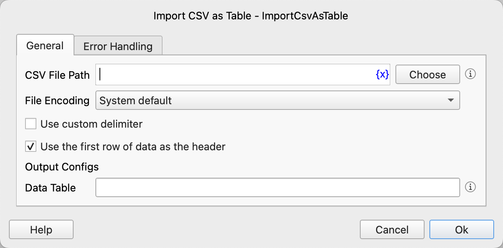

# Import CSV as Table

Import a CSV file as a data table.

## Instruction Configuration

### CSV File Path

Enter or select the CSV file path.

### File Encoding

Select the file encoding.

### Use Custom Delimiter

Choose whether to use a custom delimiter.

### Custom Delimiter

Enter the custom delimiter.

### Use the First Row of Data as the Header

Choose whether to use the first row of data as the header.

### Data Table

Enter the variable name used to save the data table.

### Error Handling

If an error occurs during the execution of the instruction, error handling will be performed. For details, see [Error Handling of Instructions](../../manual/error_handling.md).
