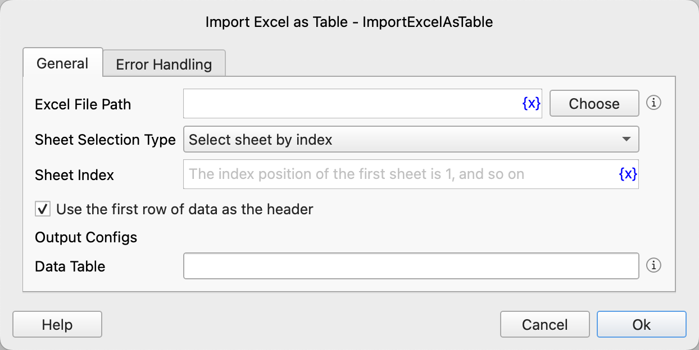

# Import Excel as Table

Import an Excel worksheet as a data table.

## Instruction Configuration

### Excel File Path

Enter or select the Excel file path..xls or.xlsx files are supported.

### Sheet Selection Type

Select the Sheet selection type. Options include: Select Sheet by Index, Select Sheet by Name.

### Sheet Index

If you choose to select the Sheet by index, enter the Sheet index, starting from 1.

### Sheet Name

If you choose to select the Sheet by name, enter the Sheet name.

### Use the First Row of Data as the Header

Select whether to use the first row of data as the header.

### Data Table

Enter the variable name used to save the data table.

### Error Handling

If an error occurs during the execution of the instruction, perform error handling. For details, see [Error Handling of Instructions](../../manual/error_handling.md).
