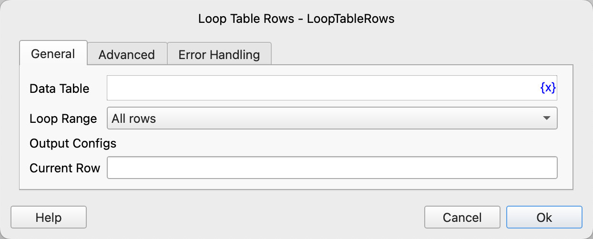
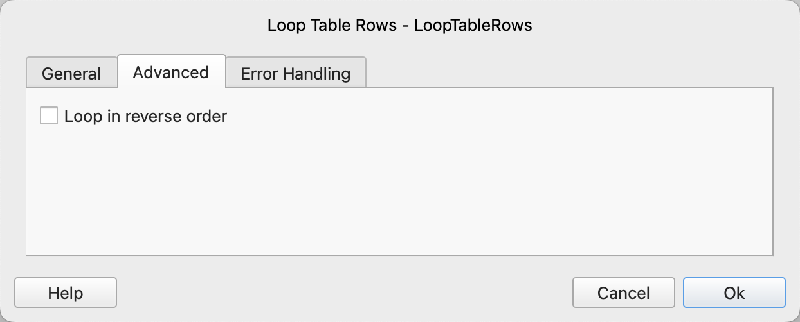

# Loop Table Rows

Loop through each row of data in the table, and then execute the instructions within the loop.

## Instruction Configuration

### Data Table

Select the data table to loop through.

### Loop Range

Select the loop range. The options are: all rows, specified range.

### Starting Row Number

If traversing a specified range, you need to enter the starting row number, starting from 1. -n represents the nth row from the end.

### Ending Row Number

If traversing a specified range, you need to enter the ending row number, starting from 1. -n represents the nth row from the end.

### Current Row

Enter the variable name used to save the current row for use in subsequent instructions.

### Loop in reverse order

Select whether to traverse in reverse order.

### Error Handling

If an error occurs during instruction execution, error handling will be performed. For details, see [Error Handling of Instructions](../../manual/error_handling.md).
