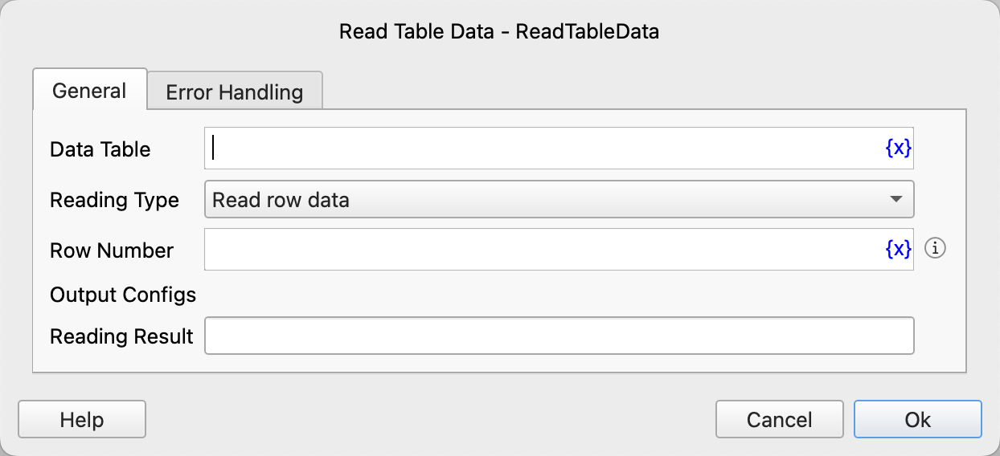

# Read Table Data

Read a row or cell data from a data table.

## Instruction Configuration

### Data Table

Select the data table to be read.

### Reading Type

Select the reading type. The options are: read row data, read cell data.

### Row Number

Enter the row number to be read, starting from 1. -n represents the nth row from the bottom.

### Column Number

If reading cell data, you need to enter the column number of the cell, starting from 1. -n represents the nth column from the bottom.

### Reading Result

Enter the variable name used to save the reading result.

### Error Handling

If an error occurs during the execution of the instruction, perform error handling. For details, see [Error Handling of Instructions](../../manual/error_handling.md).