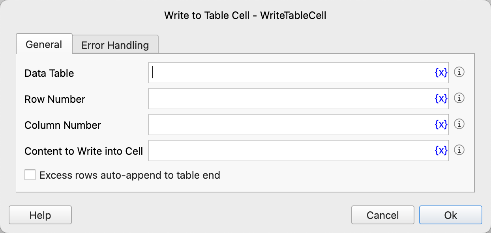

# Write to Table Cell

Write cell data into a data table.

## Instruction Configuration

### Data Table

Select the data table to operate on.

### Row Number

Enter the row number of the cell, starting from 1. -n represents the nth row from the bottom.

### Column Number

Enter the column number of the cell, starting from 1. -n represents the nth column from the right.

### Content to Write into Cell

Enter the content to be written into the cell.

### Excess rows auto-append to table end

After checking this option, when the entered row number is greater than the number of rows in the table, the entered content will be written to the next row below the last row of the table.

### Error Handling

If an error occurs during the execution of the instruction, error handling will be performed. For details, see [Error Handling of Instructions](../../manual/error_handling.md).
