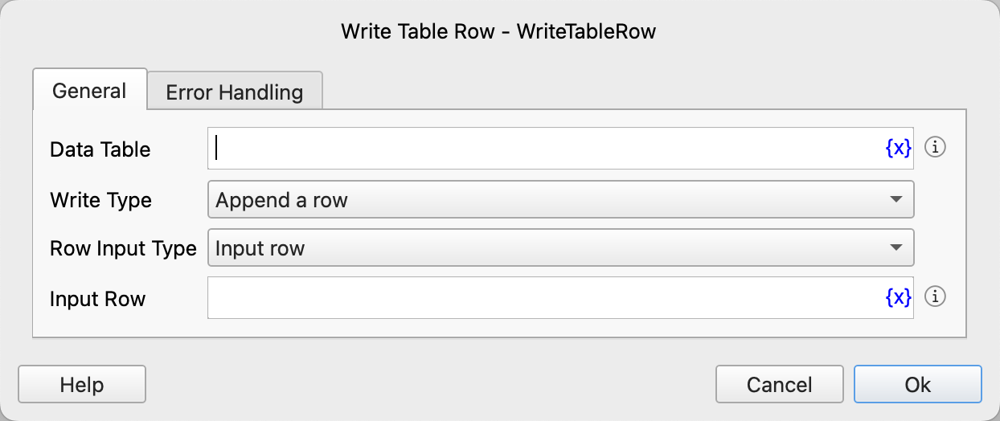

# Write Table Row

Write a row of data into the data table.

## Instruction Configuration

### Data Table

Select the data table to operate on.

### Write Type

Select the write type. The available options are: append a row, insert a row, update a row.

### Row Number

If you select insert or update, you need to enter the row number, starting from 1, and -n represents the nth row from the end.

### Row Input Type

Select the type of inputting row data. You can choose:

* Input Row: Directly input a list containing row data.
* Input Columns: Input the data of each column of the row data.

### Input Row

Input the data row to be written. This data row must be a list, and the values in the list represent the data of each column.

### Input Columns

Input the data of each column of the data row.

### Error Handling

If an error occurs during the execution of the instruction, error handling will be performed. For details, see [Error Handling of Instructions](../../manual/error_handling.md).
