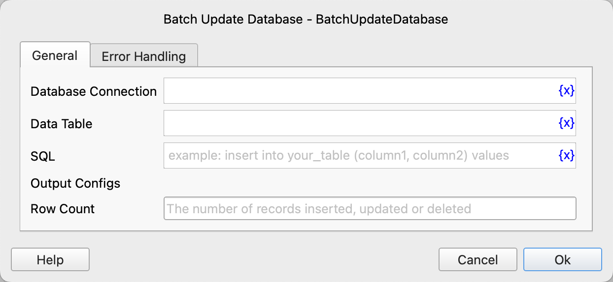

# Batch Update Database

Based on table data and SQL statements with placeholders, batch update the database and save the number of affected rows to a variable.

## Instruction Configuration

### Database Connection

Select the database connection object to execute the SQL statement.

### Data Table

Select the data table object to be used as input for the SQL statement.

### SQL

Enter the SQL statement to be executed, which can contain placeholders in the format `@DataTableColumnName@`.

During execution, the instruction will read the data from the data table row by row, replace the placeholders, and then execute the SQL statement.

### Row Count

After the instruction is successfully executed, the number of affected rows will be saved to this variable.

### Error Handling

If an error occurs during the execution of the instruction, error handling will be performed. For details, refer to [Error Handling for Instructions](../../manual/error_handling.md).
