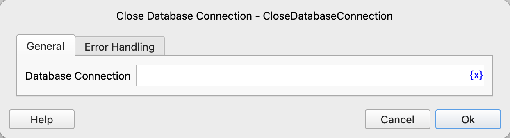

# Close Database Connection

Close the previously opened database connection.

## Instruction Configuration

### Database Connection

Select the database connection object to be closed.

### Error Handling

If the instruction execution encounters an error, perform error handling. For details, refer to [Error Handling of Instructions](../../manual/error_handling.md).
