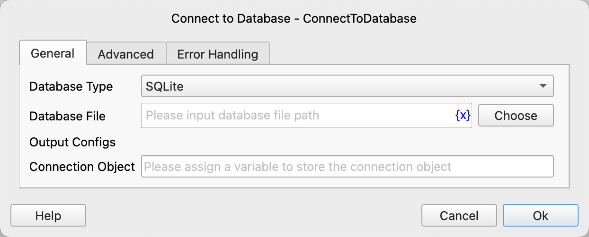
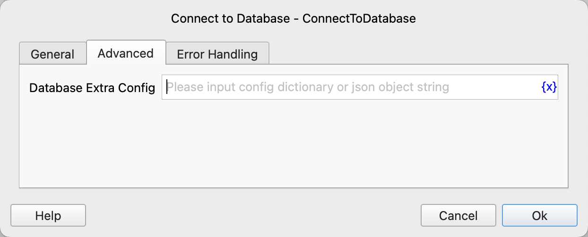

# Connect to Database

Create a connection to the database and save the connection object to a variable.

## Instruction Configuration

### Database Type

Select the type of database to connect to. Currently, the following database types are supported:

- SQLite: SQLite database
- MySQL: MySQL database
- SQL Server: SQL Server database
- PostgreSQL: PostgreSQL database

### Database File

If SQLite is selected, specify the path to the database file.

### Database Host

If MySQL, SQL Server, or PostgreSQL is selected, specify the hostname of the database.

### Database Port

If MySQL, SQL Server, or PostgreSQL is selected, you can specify the port number of the database. If not specified, the default port number will be used.

The default ports for each database are as follows:

| Database Type | Default Port |
| --- | --- |
| MySQL | 3306 |
| SQL Server | 1433 |
| PostgreSQL | 5432 |

### Database Name

If MySQL, SQL Server, or PostgreSQL is selected, you can specify the name of the database.

### Database User

For MySQL, SQL Server, or PostgreSQL databases, if authentication is required, specify the username for the database.

### Database Password

For MySQL, SQL Server, or PostgreSQL databases, if authentication is required, specify the password for the database.

### Database Extra Config

Additional configuration allows you to specify extra database connection parameters, which will be passed to the database connection function.

Common configurations for SQLite databases are as follows:

| Parameter Name | Parameter Type | Default Value | Description |
| --- | --- | --- | --- |
| timeout | float | 5 | The number of seconds to wait before raising an OperationalError when a table is locked. If another connection opens a transaction to modify the table, the table will be locked until the transaction is committed. Default is 5 seconds. |

For the complete list of SQLite configuration parameters, refer to: [SQLite3 Connection Parameters](https://docs.python.org/3/library/sqlite3.html#sqlite3.connect).

Common configurations for MySQL databases are as follows:

| Parameter Name | Parameter Type | Default Value | Description |
| --- | --- | --- | --- |
| use_unicode | boolean | true | Whether to use Unicode. |
| charset | string | utf8mb4 | The MySQL character set to use. |
| collation | string | utf8mb4_general_ai_ci | The MySQL collation to use. |
| time_zone | string |  | The MySQL time zone to use. |
| connection_timeout | integer |  | Connection timeout in seconds. |
| read_timeout | integer | No limit by default | Read timeout in seconds. |
| write_timeout | integer | No limit by default | Write timeout in seconds. |
| ssl_ca | string |  | File containing the SSL certificate authority. |
| ssl_cert | string |  | File containing the SSL certificate. |
| ssl_disabled | boolean | false | Whether to disable SSL connection. |
| ssl_key | string |  | File containing the SSL certificate private key. |
| ssl_verify_cert | boolean | false | When set to true, the server certificate will be checked against the certificate file specified by the ssl_ca option. Any mismatch will result in an error. |
| ssl_verify_identity | boolean | false | When set to true, the Common Name (CN) or Subject Alternative Name (SAN) of the server certificate will be verified against the hostname. |

For the complete list of MySQL configuration parameters, refer to: [MySQL Connection Parameters](https://dev.mysql.com/doc/connector-python/en/connector-python-connectargs.html).

Common configurations for SQL Server databases are as follows:

| Parameter Name | Parameter Type | Default Value | Description |
| --- | --- | --- | --- |
| timeout | integer | 0 | Query timeout in seconds, default is 0 (no timeout). |
| login_timeout | integer | 0 | Connection and login timeout in seconds, default is 60. |
| charset | string |  | The character set used to connect to the database. |
| read_only | boolean | false | Whether to open the connection in read-only mode. |

For the complete list of SQL Server configuration parameters, refer to: [SQL Server Connection Parameters](https://pymssql.readthedocs.io/en/stable/ref/pymssql.html#functions).

Common configurations for PostgreSQL databases are as follows:

| Parameter Name | Parameter Type | Default Value | Description |
| --- | --- | --- | --- |
| connect_timeout | integer |  | The maximum time to wait for a connection, in seconds. Zero, negative, or unspecified values mean wait indefinitely. |
| client_encoding | string |  | The client character set. |
| tcp_user_timeout | integer |  | Controls the number of milliseconds that transmitted data may remain unacknowledged before the connection is forcibly closed. A value of zero uses the system default. |

For the complete list of PostgreSQL configuration parameters, refer to: [PostgreSQL Connection Parameters](https://www.postgresql.org/docs/current/libpq-connect.html#LIBPQ-PARAMKEYWORDS).

### Connection Object

Enter the variable name to save the connection object.

### Error Handling

If the instruction execution fails, error handling will be performed. For details, refer to [Error Handling for Instructions](../../manual/error_handling.md).
