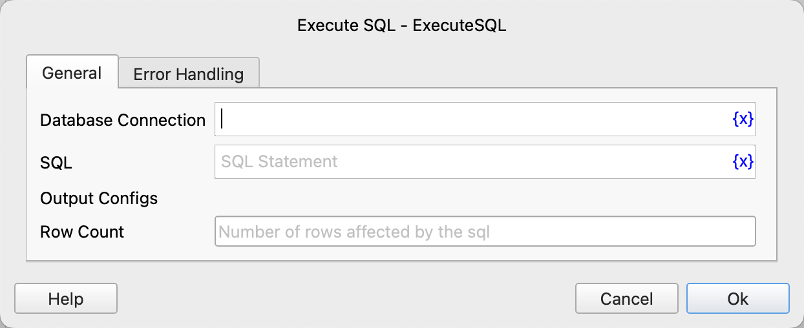

# Execute SQL

Execute SQL statements such as insert, update, delete in the target database, and save the number of affected rows to a variable.

## Instruction Configuration

### Database Connection

Select the database connection object to execute the SQL statement.

### SQL

Enter the SQL statement to be executed.

### Row Count

After the instruction is successfully executed, save the number of affected rows to this variable.

### Error Handling

If the instruction execution fails, perform error handling. For details, refer to [Error Handling for Instructions](../../manual/error_handling.md).
