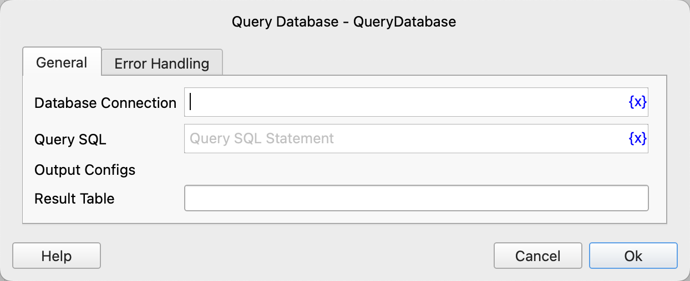

# Query Database

Execute SQL query statements in the target database and save the query results to a variable.

## Instruction Configuration

### Database Connection

Select the database connection object to execute the SQL statement.

### Query SQL

Enter the SQL query statement to be executed.

### Result Table

Enter the variable name of the data table type used to save the query results.

### Error Handling

If the instruction execution encounters an error, perform error handling. For details, refer to [Error Handling of Instructions](../../manual/error_handling.md).
