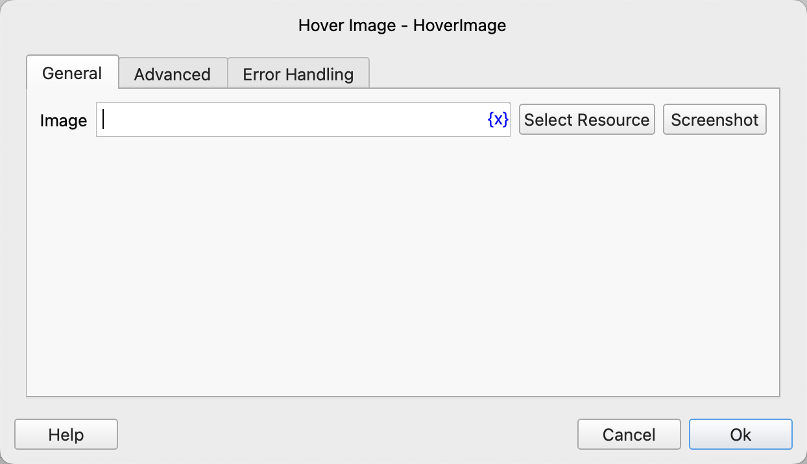
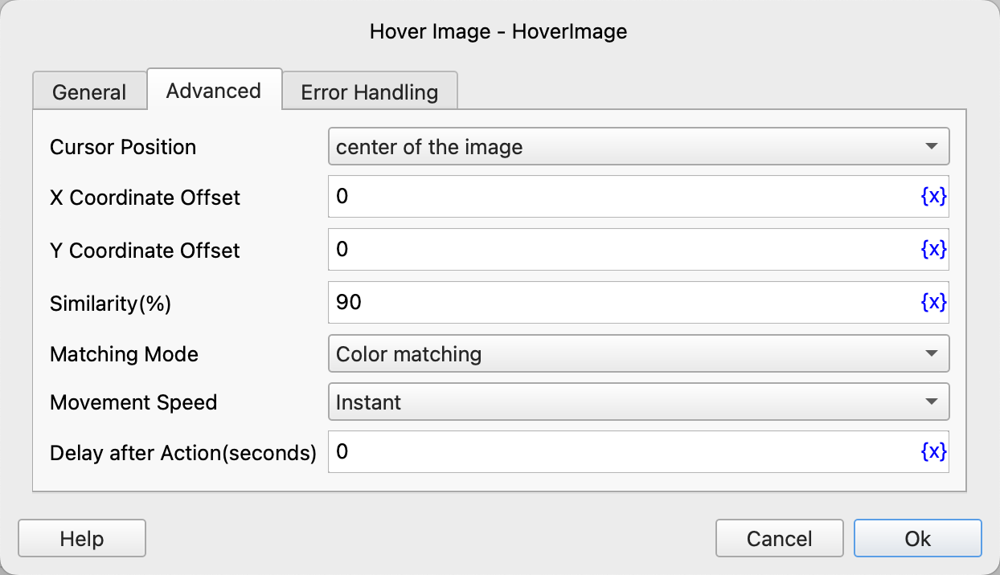

# Hover the Mouse over the Image

Locate the image on the screen and move the mouse over the image.

## Instruction Configuration

### Image

Click the "Select Resource" button to select the image file you want to search for from the resource library, or click the "Screenshot" button to take a screenshot using the screenshot tool.

Please ensure that the resolution of the screenshot is the same as the system's screen resolution, otherwise the positioning may fail.

### Cursor Position

Select the cursor position to move to. The optional values are: center of the image, upper left corner of the image, with the center of the image as the default.

### X Coordinate Offset

Fill in the X coordinate offset. A positive number moves the cursor to the right, and a negative number moves it to the left. The default value is 0.

### Y Coordinate Offset

Fill in the Y coordinate offset. A positive number moves the cursor downwards, and a negative number moves it upwards. The default value is 0.

### Similarity (%)

Fill in the percentage of image matching similarity. The value range is from 0 to 100, with 90 as the default.

### Matching Mode

Select the matching mode. The optional values are: color matching, grayscale matching.

### Movement Speed

Select the mouse movement speed. The optional values are instant, fast, medium, and slow.

### Delay after Action

After executing the instruction, delay for a certain period of time before continuing to execute the subsequent instructions. The unit is seconds.

### Error Handling

If an error occurs during the execution of the instruction, error handling will be performed. For details, please refer to [Error Handling of Instructions](../../manual/error_handling.md).
