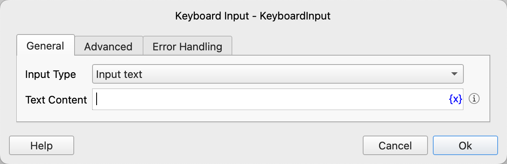
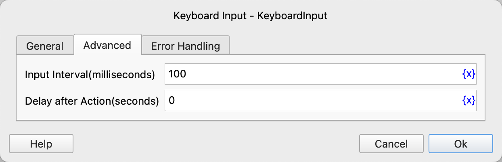

# Keyboard Input

Input text or use shortcut keys through the keyboard.

## Instruction Configuration

### Input Type

Select the input type. The available values are input text and input hotkey.

### Text Content

If you choose to input text, you need to fill in the text content to be input.

Note: All Unicode characters such as Chinese and English are supported in Windows. Only English characters are supported in Linux and MacOS. If you need to input non-English characters in Linux and MacOS, please use the [Set Clipboard Text Instruction](../OperatingSystem/set_clipboard_text.md) and the paste shortcut key to achieve this.

### Hotkey Type

If you choose to input a hotkey, you need to select the hotkey type. The available values are: common hotkey, custom hotkey.

### Common Hotkey

Select a common shortcut key. The available values are:

* Ctrl/Cmd+C
* Ctrl/Cmd+V
* Ctrl/Cmd+X
* Ctrl/Cmd+Z
* Ctrl/Cmd+S
* Ctrl/Cmd+A
* Enter

The "Ctrl/Cmd" key is the Ctrl key in Windows and Linux, and the Command key in MacOs.

### Custom Hotkey

Configure each key of the hotkey one by one.

### Input Interval

The interval time between each input when inputting text, with a default of 100 milliseconds.

### Delay after Action

After executing the instruction, delay for a period of time before continuing to execute subsequent instructions. The unit is seconds.

### Error Handling

If an error occurs during the execution of the instruction, perform error handling. For details, see [Error Handling of Instructions](../../manual/error_handling.md).
