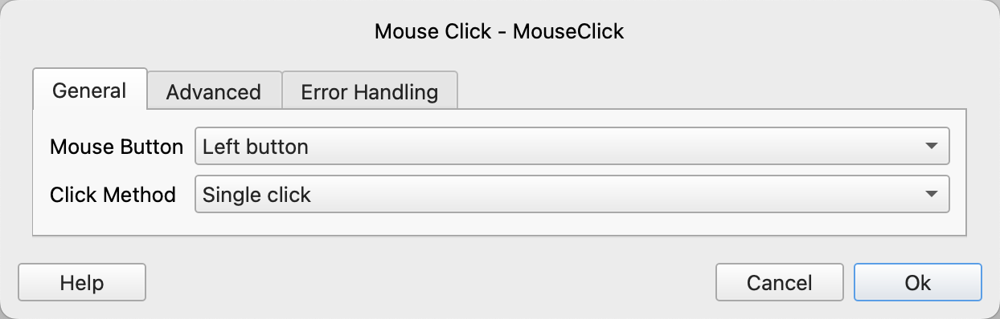
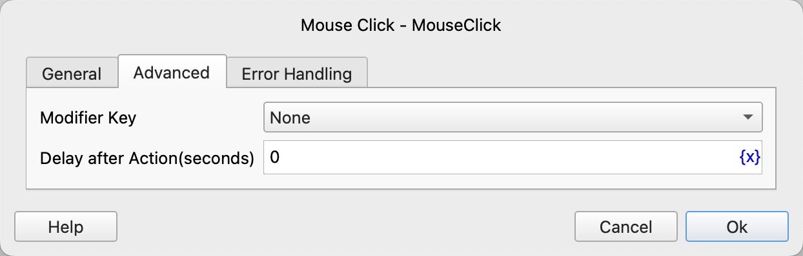

# Mouse Click

Click the specified mouse button.

## Instruction Configuration

### Mouse Button

Select the mouse button to click. The available options are left button, right button, and middle button.

### Click Method

Select the click method. The available options are single - click, double - click, mouse down, and mouse up.

### Modifier Key

Select the keyboard key to press simultaneously when clicking the mouse. The available options are: none, Alt, Ctrl, Ctrl or Meta (automatically selected according to the operating system, Meta for MacOS and Ctrl for other operating systems), Meta, Shift.

### Delay After Action

After executing the instruction, delay for a period of time before continuing to execute subsequent instructions. The unit is seconds.

### Error Handling

If an error occurs during the execution of the instruction, error handling will be performed. For details, see [Error Handling of Instructions](../../manual/error_handling.md).
