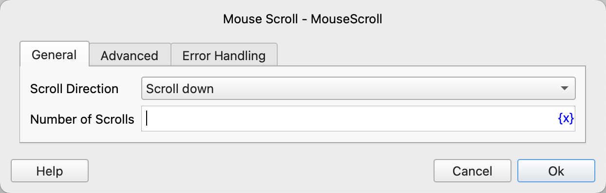
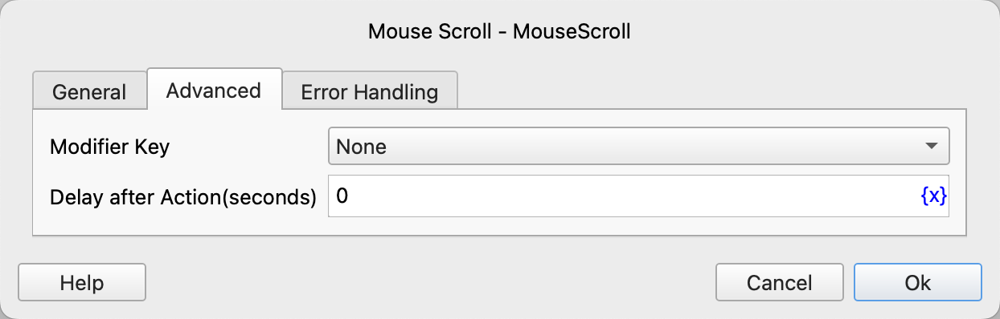

# Mouse Scroll

Scroll the mouse wheel.

## Instruction Configuration

### Scroll Direction

Select the scroll direction. The available values are scroll up and scroll down.

### Number of Scrolls

Fill in the number of scrolls.

### Modifier Key

Select the keyboard key to be pressed simultaneously when scrolling the mouse. The available values are: None, Alt, Ctrl, Ctrl or Meta (automatically selected according to the operating system, Meta for MacOS and Ctrl for other operating systems), Meta, Shift.

### Delay after Action

After executing the instruction, delay for a certain period of time before continuing to execute the subsequent instructions. The unit is seconds.

### Error Handling

If an error occurs during the execution of the instruction, perform error handling. For details, see [Error Handling of Instructions](../../manual/error_handling.md).
