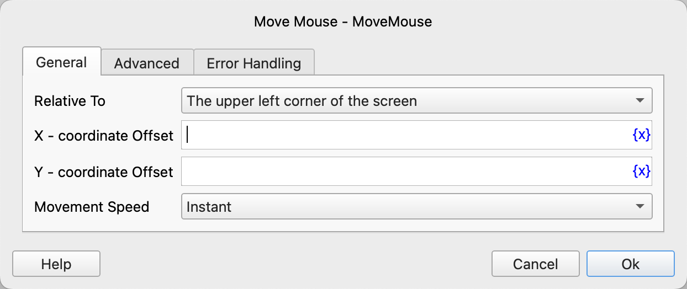
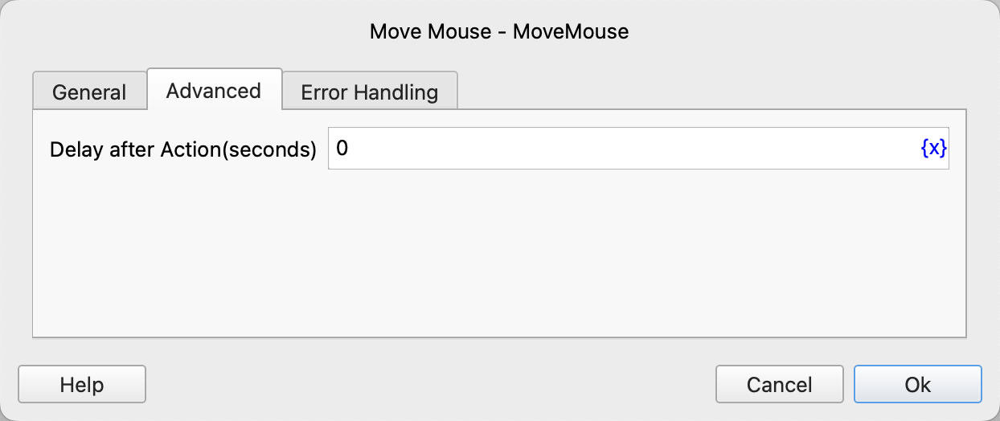

# Move Mouse

Move the mouse to the specified position.

## Instruction Configuration

### Relative To

Select to move the mouse relative to the upper left corner of the screen or the current mouse position.

### X - coordinate Offset

Fill in the X - coordinate offset. A positive number moves the mouse to the right, and a negative number moves it to the left.

### Y - coordinate Offset

Fill in the Y - coordinate offset. A positive number moves the mouse downwards, and a negative number moves it upwards.

### Movement Speed

Select the movement speed. The available values are instant, fast, medium - speed, and slow.

### Delay After Action

After executing the instruction, delay for a period of time before continuing to execute the subsequent instructions. The unit is seconds.

### Error Handling

If an error occurs during the execution of the instruction, perform error handling. For details, see [Error Handling of Instructions](../../manual/error_handling.md).
