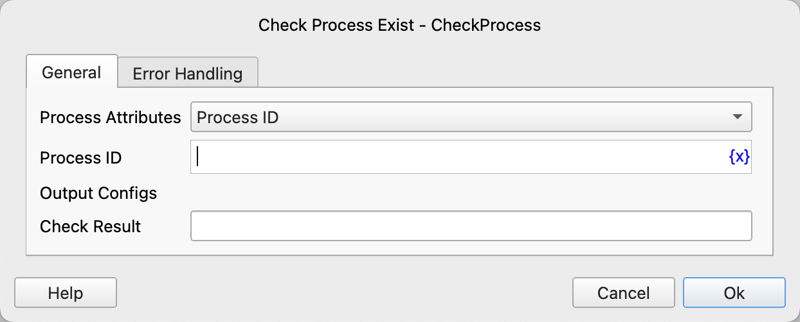

# Check Process Exist

Check if a process exists on the operating system.

## Instruction Configuration

### Process Attributes

Select the attribute to search for the process. Options include: Process ID, Process Name.

### Process ID

Enter the Process ID to be checked.

### Process Name

Enter the Process Name to be checked.

### Check Result

Enter the variable name to store the check result. If the process exists, the variable value will be true; otherwise, it will be false.

### Error Handling

If the instruction execution encounters an error, error handling will be performed. For details, refer to [Error Handling for Instructions](../../manual/error_handling.md).
