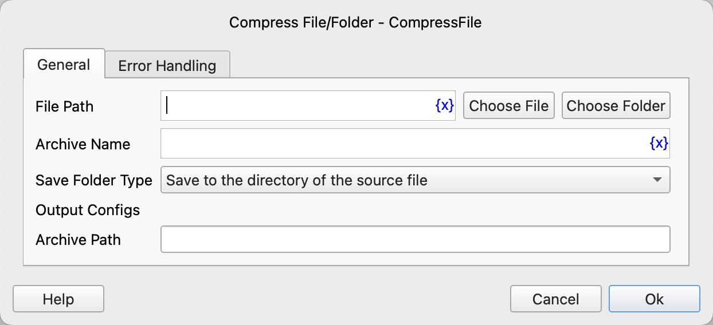

# Compress File/Folder

Compress files or folders into a zip archive.

## Instruction Configuration

### File Path

Enter or select the path of the file or folder to be compressed.

### Archive Name

Enter the name of the archive without the file extension.

### Save Folder Type

* Save to the directory of the source file
* Save to a specified folder

### Save Folder

If you choose to save to a specified folder, you need to enter or select the path of the save folder.

### Archive Path

Enter the variable name for the path where the archive file will be saved.

### Error Handling

If the instruction execution encounters an error, error handling will be performed. For details, see [Error Handling for Instructions](../../manual/error_handling.md).