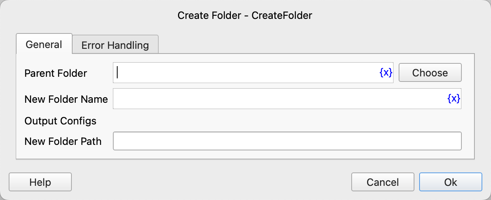

# Create Folder

Create a new folder.

## Instruction Configuration

### Parent Folder

Enter or select the parent folder.

### New Folder Name

Enter the name of the new folder.

### New Folder Path

Enter the variable name for saving the path of the new folder.

### Error Handling

If the instruction execution encounters an error, error handling will be performed. For details, refer to [Error Handling for Instructions](../../manual/error_handling.md).
