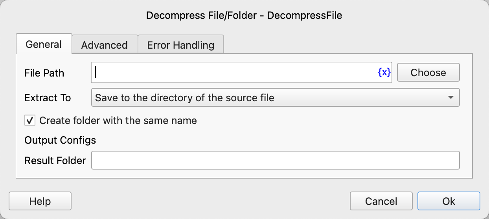
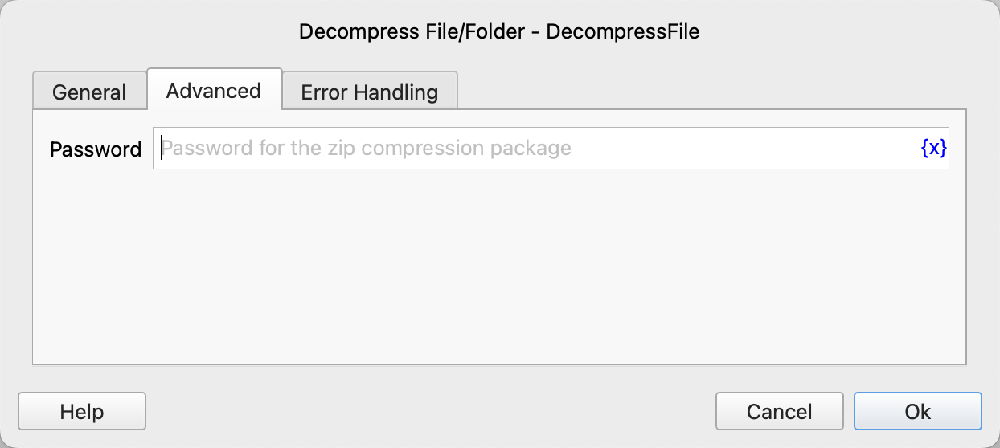

# Decompress Files/Folders

Extract a zip archive to a specified folder.

## Instruction Configuration

### File Path

Enter or select the file path of the zip archive.

### Extract To

* Save to the directory of the source file
* Save to a specified folder

### Save Folder

If you choose to save to a specified folder, you need to enter or select the path of the save folder.

### Create Folder with the Same Name

Whether to create a folder with the same name as the archive in the target folder and then extract the archive into this folder.

### Result Folder

Enter the variable name used to save the extraction path of the archive.

### Password

Enter the password for the archive.

### Error Handling

If the instruction execution encounters an error, error handling will be performed. For details, refer to [Error Handling for Instructions](../../manual/error_handling.md).