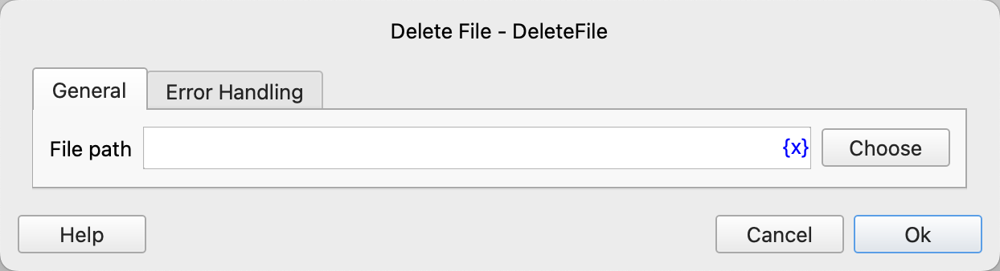

# Delete File

Delete a file.

## Instruction Configuration

### File Path

Enter or select the file path to be deleted.

### Error Handling

If the instruction execution encounters an error, error handling will be performed. For details, refer to [Error Handling for Instructions](../../manual/error_handling.md).