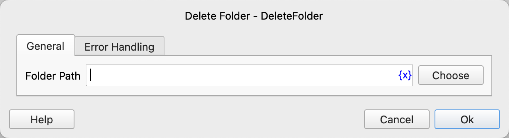

# Delete Folder

Delete a folder.

## Instruction Configuration

### Folder Path

Enter or select the path of the folder to be deleted.

### Error Handling

If the instruction execution encounters an error, error handling will be performed. For details, refer to [Error Handling for Instructions](../../manual/error_handling.md).