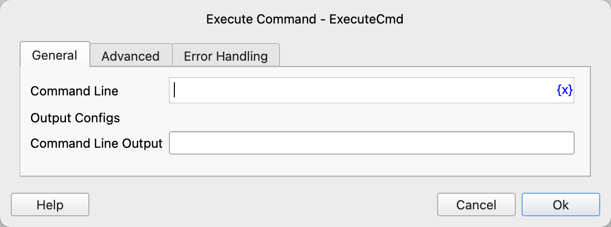
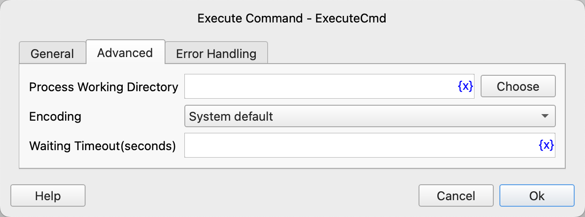

# Execute Command

Execute a command line program.

## Instruction Configuration

### Command Line

Enter the command line to be executed.

### Command Line Output

Enter the variable name to save the command line output.

### Process Working Directory

Enter or select the working directory for the command line process.

### Encoding

Select the encoding for the command line output.

### Waiting Timeout

Enter the timeout duration for the command line process execution in seconds. By default, there is no limit.

### Error Handling

If the instruction execution encounters an error, error handling will be performed. For details, refer to [Error Handling for Instructions](../../manual/error_handling.md).
