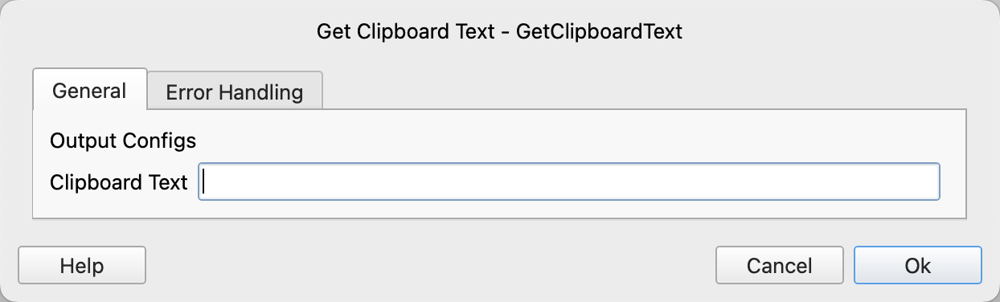

# Get Clipboard Text

Retrieve the text from the clipboard.

## Instruction Configuration

### Clipboard Text

Enter the variable name to save the clipboard text.

### Error Handling

If the instruction execution encounters an error, error handling will be performed. For details, refer to [Error Handling for Instructions](../../manual/error_handling.md).