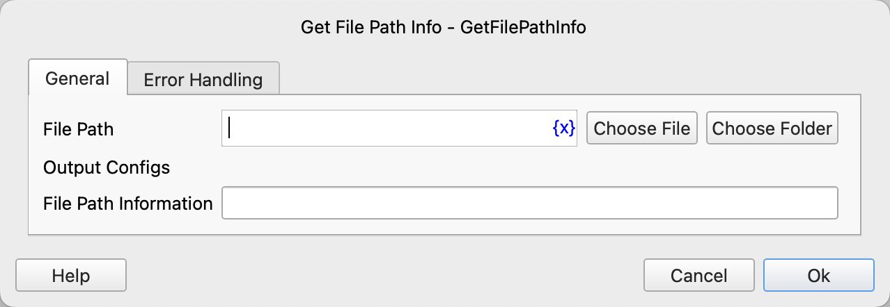

# Get File Path Info

Retrieve file path information.

## Instruction Configuration

### File Path

Enter or select the path of the file or folder.

### File Path Information

Enter the variable name to store the file path information object.

The file path information object has the following properties:

* root: Root directory
* parent: Parent directory
* name: File name
* nameWithoutExtension: File name without extension
* extension: File extension
* exists: Whether the file exists
* isDirectory: Whether it is a directory
* isFile: Whether it is a file
* size: File size in bytes
* ctime: Creation time, a timestamp in seconds
* mtime: Modification time, a timestamp in seconds

### Error Handling

If the instruction execution encounters an error, error handling will be performed. For details, refer to [Error Handling for Instructions](../../manual/error_handling.md).
