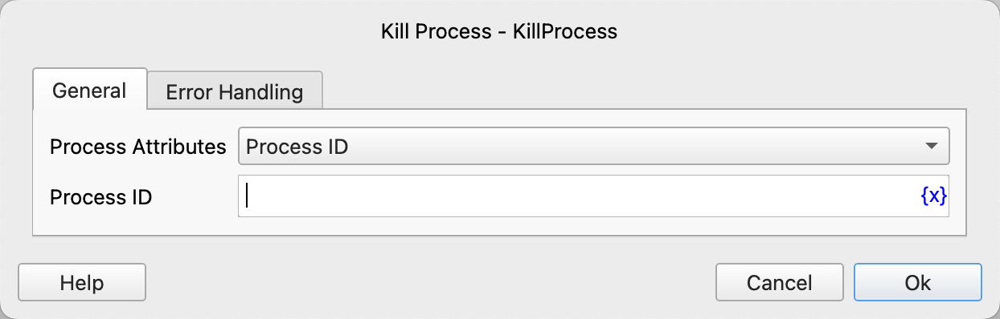

# Kill Process

Terminate a running process on the operating system.

## Instruction Configuration

### Process Attributes

Select the attribute to terminate the process by. Options include: Process ID, Process Name.

### Process ID

Enter the Process ID of the process to be terminated.

### Process Name

Enter the name of the process to be terminated.

### Error Handling

If the instruction execution encounters an error, error handling will be performed. For details, refer to [Error Handling for Instructions](../../manual/error_handling.md).
