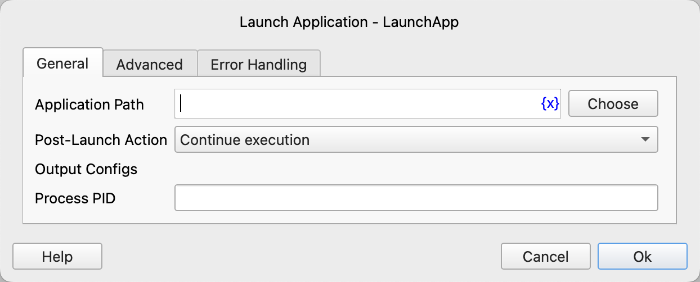
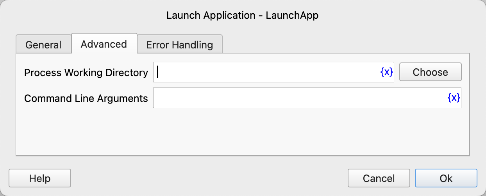

# Launch Application

Launch an application.

## Instruction Configuration

### Application Path

Enter or select the path of the application to be launched.

### Post-Launch Action

Select the action to be taken after launching the application. Options include:
* Continue Execution: Proceed to execute subsequent instructions.
* Wait for Application to Complete: Wait for the application to finish executing, then proceed to execute subsequent instructions.

### Process PID

Enter the variable name used to save the process PID.

### Process Working Directory

Enter or select the working directory of the application to be launched.

### Command Line Arguments

Enter the command line arguments to be passed to the application.

### Waiting Timeout

Enter the waiting timeout for the application to complete.

### Error Handling

If the instruction execution encounters an error, error handling will be performed. For details, refer to [Error Handling for Instructions](../../manual/error_handling.md).
