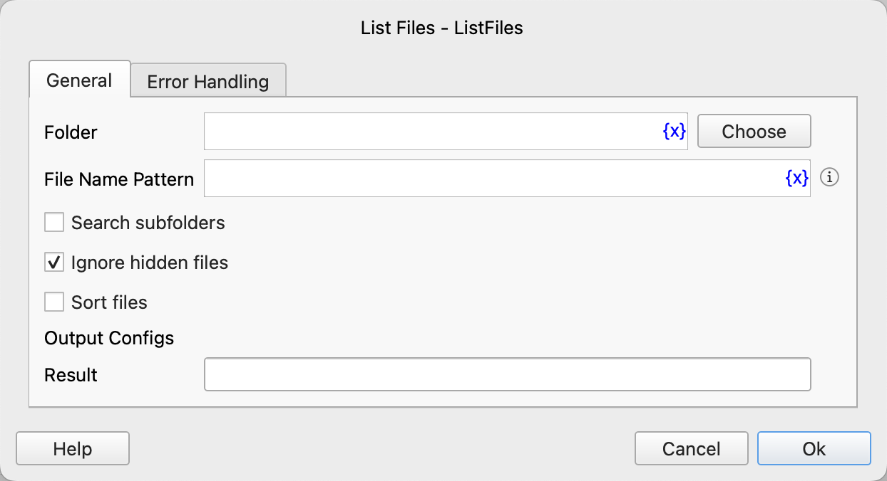

# List Files

Retrieve the list of files in a specified folder.

## Instruction Configuration

### Folder

Enter or select the folder path.

### File Name Pattern

Enter the pattern used to filter file names.

The file name pattern is a special string composed of ordinary characters and wildcards. The syntax for wildcards is as follows:

1. *: Matches zero or more characters (including any characters in the file name).

    For example: *.txt matches all .txt files.

2. ?: Matches a single character.

    For example: file?.txt matches file1.txt, fileA.txt, etc., but not file.txt.

3. [...]: Matches any one character within the brackets.

    For example: file[1-3].txt matches file1.txt, file2.txt, and file3.txt.

4. [!...]: Matches any one character not within the brackets.

    For example: file[!a-z].txt matches file1.txt, file2.txt, and file3.txt.

5. **: Matches zero or more directories (can span subdirectories).

    For example: **/*.txt matches all .txt files in the current directory and all subdirectories.

### Search Subfolders

Enable this option to recursively search subfolders.

### Ignore Hidden Files

Enable this option to ignore hidden files.

### Sort Files

Enable this option to sort the matched file list.

### Sorting Criteria

If sorting files is enabled, you need to select the criteria for sorting. Available options are: file name, file size, creation time, last modification time.

### Sorting Order

If sorting files is enabled, you need to select the sorting order. Available options are: ascending, descending.

### Result

Enter the variable name to store the list of found file paths.

### Error Handling

If the instruction execution encounters an error, error handling will be performed. For details, see [Error Handling for Instructions](../../manual/error_handling.md).
